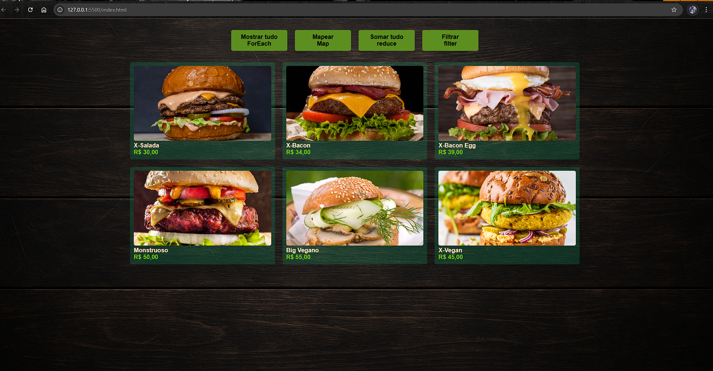

# 🍔 Dev Burger

Projeto desenvolvido com o objetivo de praticar os métodos de array do JavaScript: `forEach`, `map`, `reduce` e `filter`.

## 🚀 Objetivo

Este projeto simula um cardápio digital de hambúrgueres e foi criado para demonstrar, na prática, o uso dos principais métodos de manipulação de arrays no JavaScript.

Cada botão interage com os dados usando uma das funções:

- 🔁 `forEach`: exibe todos os produtos na tela.
- 💸 `map`: aplica um desconto de 10% em todos os produtos.
- ➕ `reduce`: calcula o valor total de todos os produtos.
- 🌱 `filter`: exibe apenas os produtos veganos.

---

## 🛠️ Tecnologias

- HTML
- CSS
- JavaScript Vanilla

---

